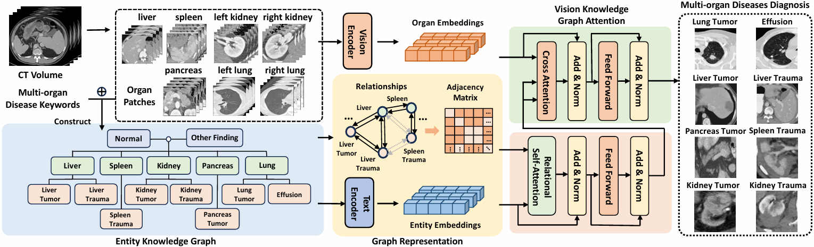

# Entity Knowledge Graph Enhanced Vision Language Model for Multi-Organ Diagnosis

## Introduction
Pytorch implementation for ISBI 2026 paper **[Entity Knowledge Graph Enhanced Vision Language Model for Multi-Organ Diagnosis
](https://github.com/Jianxun98/EKG-VLM)**

> Diagnosing diseases from multiple organs is common in clinical practice but remains challenging. This task demands radiologists’ implicit understanding of the structural and functional inter-dependencies within organ systems. Incorporating such anatomical ontology knowledge into deep learning models can substantially enhance performance; however, effective strategies for integrating such knowledge with deep learning are not yet well established. To bridge this gap, we propose to encode anatomical ontologies as the entity knowledge graph (EKG) and fuse the graph representations with organ-level 3D CT features for diagnosis. Specifically, we construct the EKG that captures relationships among relevant diseases and organs. This graph is encoded into graph embeddings and further fused with organ-centric patch features via an attention mechanism. By such integration, we can ultimately improve diagnostic accuracy by aligning visual evidence with clinically grounded anatomical priors. We have conducted experiments on a large-scale dataset comprising nine public datasets. The effectiveness of our method is demonstrated by significant performance gains over state-of-the-art methods, patient-level diagnostic sensitivity improves by 5.98\%, and organ-level sensitivity increases by 10.02\%.

## Usage
Code coming soon

### Contact
For any questions, please contact ‘jianxyu98@gmail.com’
